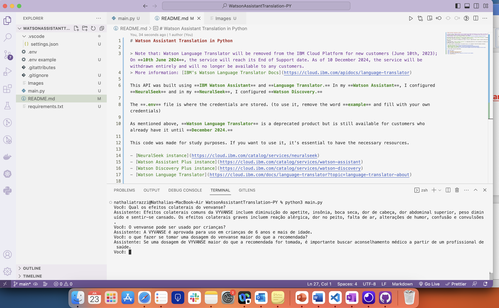
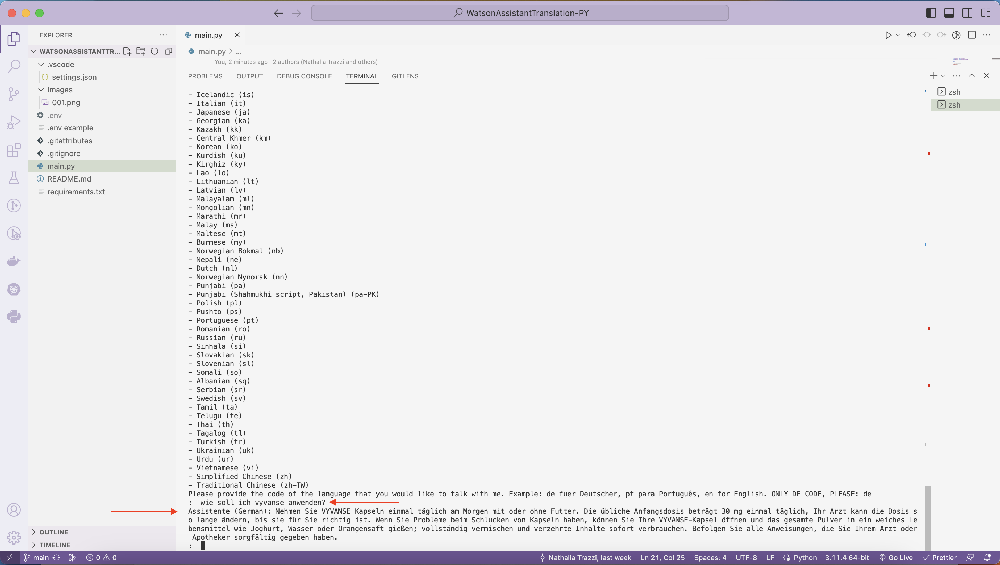

# Watson Assistant Translation in Python

Using Language Translator from IBM to translate user's input and Watson Assistant responses to Portuguese.

> Note that: Watson Language Translator will be removed from the IBM Cloud Platform for new customers (June 10th, 2023); On **10th June 2024**, the service will reach its End of Support date. As of 10 December 2024, the service will be withdrawn entirely and will no longer be available to any customers.
> More information: [IBM's Watson Language Translator Docs](https://cloud.ibm.com/apidocs/language-translator)

This API was built using **IBM Watson Assistant** and **Language Translator.** In my **Watson Assistant**, I configured **NeuralSeek** and in my **NeuralSeek**, I configured **Watson Discovery.**

The **.env** file is where the credentials are stored. (to use it, remove the word **example** and fill with your own credentials)

As mentioned above, **Watson Language Translator** is a deprecated product but is still available for customers who already have it until **December 2024.**

This code was made for study purposes. If you want to use it, it's essential to have the necessary resources.

- [NeuralSeek instance](https://cloud.ibm.com/catalog/services/neuralseek)
- [Watson Assistant Plus instance](https://cloud.ibm.com/catalog/services/watson-assistant)
- [Watson Discovery Plus instance](https://cloud.ibm.com/catalog/services/watson-discovery)
- [Watson Language Translator](https://cloud.ibm.com/docs/language-translator?topic=language-translator-about)

To run the code, follow the steps below:

1. Open your terminal
2. Type `git clone `
3. Type `cd WatsonAssistantTranslation-PY/`
4. Type `pip3 install requirements.txt`
5. Fill .env example file your own credentials and remove the word example.
6. Type `python3 main.py`

Then provide **only the code of the language** that you would like to start a conversation with asssistant

Now send your question and wait for Assistant's answer.

